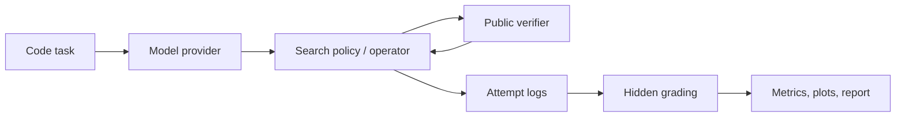

# TTC OperatorBench

[](https://github.com/nicholaszhao-19/ttc-operatorbench/actions/workflows/checks.yml)

TTC OperatorBench is an early-stage research harness for evaluating
verifier-guided code reasoning policies under explicit test-time compute
budgets. The project studies whether adaptive operator allocation can compete
with fixed verifier-guided baselines while preserving auditable logs, metrics,
and reproducible experiment configs.

The public-facing claim is deliberately conservative: this is a reproducible
evaluation harness for budget-aware code-generation research, not a premature
state-of-the-art scheduler claim.

## Why This Repo Is Interesting

- It treats test-time compute as an experimental object: attempts, tokens,
  verifier calls, wall-clock time, and cost can all be budgeted.
- It separates policy-visible public tests from hidden evaluation tests.
- It preserves attempt-level traces, aggregate metrics, plots, and decision
  reports.
- It includes fixed baselines, repair/revision policies, and adaptive operator
  scheduling.
- It reports ties, losses, and inconclusive outcomes instead of hiding them.



The Python project lives in:

```text
ttc-operatorbench/
```

Start there for the full README and commands:

[ttc-operatorbench/README.md](ttc-operatorbench/README.md)

## Reviewer Quickstart

```bash
cd ttc-operatorbench
make check
uv sync --all-groups
uv run --python 3.12 python scripts/run_experiment.py
```

`make check` is the fastest no-model verification path. The default experiment
is a deterministic local toy protocol. It does not download or run a real model.

Expected generated artifacts:

```text
outputs/runs/toy_protocol/
reports/runs/toy_protocol/
```

## What This Repo Demonstrates

- A reproducible harness for verifier-guided code reasoning experiments.
- Budgeted evaluation over attempts, tokens, verifier calls, and time.
- Baseline policies and an adaptive `operator_bandit` scheduler.
- Public/hidden verifier separation for code tasks.
- JSONL attempt logs, aggregate metrics, plots, and decision reports.
- Opt-in Hugging Face model runners gated behind `RUN_REAL_MODEL_TESTS=1`.

The repo does not currently claim that adaptive operator allocation beats strong
real-model baselines. Current real-model results are preliminary and framed as
pipeline validation or matched-baseline probes.

## Repository Map

```text
.
|-- LICENSE
|-- README.md
`-- ttc-operatorbench/
    |-- README.md
    |-- docs/
    |-- configs/
    |-- scripts/
    |-- src/ttc_operatorbench/
    `-- tests/
```

## Documentation

- [Project overview](ttc-operatorbench/docs/project_overview.md)
- [Experiment design](ttc-operatorbench/docs/experiment_design.md)
- [Reproducibility guide](ttc-operatorbench/docs/reproducibility.md)
- [Results guide](ttc-operatorbench/docs/results_guide.md)
- [Research memo](ttc-operatorbench/docs/research_memo.md)
- [Demo result](ttc-operatorbench/docs/results/demo_report.md)
- [Presentation audit](ttc-operatorbench/docs/repo_presentation_audit.md)

## License

Apache-2.0. See [LICENSE](LICENSE).
