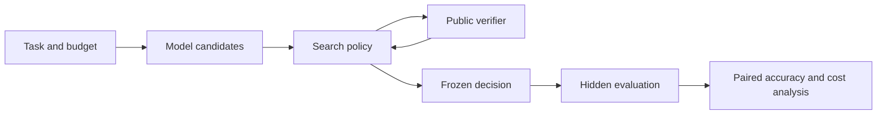

# TTC OperatorBench

[](https://github.com/nicholaszhao-19/ttc-operatorbench/actions/workflows/checks.yml)
[](LICENSE)

TTC OperatorBench is a reproducible evaluation harness for verifier-guided code
generation under explicit test-time compute budgets. It separates candidate
coverage from candidate selection, records the cost of every generated attempt,
and keeps policy-visible public evidence separate from hidden evaluation labels.

> **Research status:** the harness and two real-model EvalPlus studies are
> complete. The current evidence supports an efficient fixed stopping baseline;
> it does not establish a state-of-the-art adaptive controller.

## What It Evaluates

Given a code task, model, verifier, and finite budget, the harness compares how
search policies spend inference compute on:

- independent candidate sampling;
- public-verifier stopping;
- sequential repair and revision;
- behavioral differential selection;
- fixed or adaptive operator allocation.

It reports selected hidden correctness, oracle candidate coverage, selection
regret, false acceptance, model calls, tokens, verifier calls, and latency.



## Confirmed Evidence

All results below use the same pinned
`Qwen/Qwen2.5-Coder-1.5B-Instruct` revision and seed `0`.

| Study | Tasks | Main result | Interpretation |
|---|---:|---|---|
| HumanEval+ locked pool | 133 | Pass@1 47.6% to Pass@16 82.7%; first-public-pass selection 80.5% | Coverage was the larger bottleneck; stopping preserved the selected answer while saving 72.5% of candidate calls |
| MBPP+ frozen confirmation | 100 | `16x1` stop-only 73.0% vs `8x2` sample-and-repair 70.0%; paired difference -3.0 points, 95% CI [-8.0, +1.0] | The exploratory repair gain did not replicate; `16x1` remains the baseline to beat |

Read the [locked HumanEval+ report](ttc-operatorbench/docs/results/evalplus_selection_regret_locked.md),
the [MBPP+ confirmation report](ttc-operatorbench/docs/results/stop_then_escalate_confirmation.md),
or inspect the [hash-verified result bundle](ttc-operatorbench/artifacts/results/stop_then_escalate_v1/README.md).

## Quickstart

Requirements: Python 3.11 or 3.12 and
[`uv`](https://docs.astral.sh/uv/getting-started/installation/).

```bash
cd ttc-operatorbench
uv sync --frozen --group dev
uv run ttc-operatorbench doctor
make check
uv run ttc-operatorbench run
uv run ttc-operatorbench verify-results
```

The default run is deterministic, local, and model-free. It writes auditable
artifacts beneath `outputs/runs/toy_protocol/` and
`reports/runs/toy_protocol/`.

## Research Integrity

- Policies receive public task data and declared public verifier feedback only.
- Hidden labels are attached after policy execution and cannot affect routing.
- Candidate pools and trajectories carry model, tokenizer, dataset, Git, and
  environment provenance.
- EvalPlus candidate code runs in a pinned no-network Docker container with a
  read-only root, dropped capabilities, and resource limits.
- Matched width-depth studies can validate shared root candidates before either
  trajectory receives hidden grades.
- Negative and inconclusive results are reported rather than promoted as wins.

The generic local Python verifier executes code in a host subprocess and is for
trusted toy fixtures. Generic Hugging Face protocols require the explicit
`TTC_ALLOW_UNSANDBOXED_CODE=1` acknowledgement. Use the containerized EvalPlus
pipeline for untrusted model-generated code.

## Repository Map

```text
.
|-- README.md
|-- CONTRIBUTING.md
|-- LICENSE
`-- ttc-operatorbench/
    |-- artifacts/results/  # Compact, hash-verified derived evidence.
    |-- configs/            # Frozen experiment and model settings.
    |-- docs/               # Preregistrations, runbooks, and reports.
    |-- scripts/            # Heavyweight generation/grading entry points.
    |-- src/                # Typed package implementation.
    `-- tests/              # Fast local unit and integration coverage.
```

The [Python project README](ttc-operatorbench/README.md) documents every local
protocol. The [confirmation runbook](ttc-operatorbench/docs/experiments/stop_then_escalate_runbook.md)
gives the exact staged real-model workflow.

## Current Limits

- Evidence covers one model revision and one generation seed.
- HumanEval+ and MBPP+ are function-level benchmarks, not time-filtered or
  repository-level software engineering evaluations.
- The repository does not reproduce full S*, DiffCodeGen, learned-verifier, or
  agentic-verifier systems under matched budgets.
- No learned or rule-based adaptive controller has yet beaten the fixed
  real-model baseline.
- The default CI intentionally excludes model downloads and Docker inference;
  those paths are opt-in and locally audited.

These limits define the next experiments; they are not hidden behind a broader
claim.

## Contributing

See [CONTRIBUTING.md](CONTRIBUTING.md) for checks, research-integrity rules, and
the heavyweight-run review process. Licensed under Apache-2.0.
