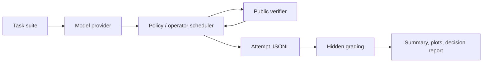

# TTC OperatorBench

[](https://github.com/nicholaszhao-19/ttc-operatorbench/actions/workflows/checks.yml)

TTC OperatorBench is an early-stage experimental harness for cost-aware adaptive
operator allocation in verifier-guided code reasoning. It provides typed
schemas, local code tasks, deterministic baselines, an adaptive
`operator_bandit` scheduler, public/hidden verifier accounting, JSONL logs,
budget-aware metrics, plots, and config-driven reports.

The project is designed as a research-engineering scaffold for test-time compute
experiments. It emphasizes reproducibility and auditability over headline
claims.

## Public Positioning

This repository is best read as a research-engineering artifact:

> A reproducible harness for evaluating budget-aware verifier-guided
> code-generation policies.

It is not currently presented as a state-of-the-art scheduler result. The
current generated demo result is a useful negative control: the adaptive policy
does not dominate the strongest fixed baseline on the deterministic toy
protocol, and the report says so directly.



## Research Question

Given a code task, a model provider, a verifier, and a finite budget, can an
adaptive search policy allocate operators more effectively than fixed
verifier-guided baselines?

The current repository validates the harness and documents preliminary local and
real-model probes. It does not establish that adaptive operator allocation beats
strong real-model baselines.

## Motivation

Reasoning and coding systems often spend extra compute at inference time:
sampling candidates, running tests, repairing failures, revising outputs, or
switching prompting strategies. A credible evaluation needs to track both
success and the budget spent to reach success.

TTC OperatorBench makes those tradeoffs explicit through:

- attempt-level logs;
- public and hidden verifier outcomes;
- token, attempt, verifier-call, and time budgets;
- baseline and adaptive search policies;
- success curves and aggregate metrics;
- decision reports that treat ties, losses, and inconclusive outcomes as
  first-class results.

## Implementation

- Typed schemas for tasks, generations, verifier results, attempts, budgets, and
  search results.
- Toy and curated local code tasks with public and hidden tests.
- Deterministic dummy providers for local structural controls.
- An opt-in Hugging Face provider for real-model smoke and curated runs.
- Baseline policies: greedy, best-of-N, repair-only, plan-then-code, and local
  revision.
- Adaptive policies: `operator_bandit` plus ablation variants.
- Python unit-test verification for generated code.
- Config-driven experiment protocols under `configs/experiments/`.
- JSONL logging, JSON/CSV summaries, success-curve plots, and Markdown reports.

## Snapshot Result

The committed deterministic toy report is intentionally modest:

- verdict: `needs_analysis`;
- decision scope: hidden-test success;
- strongest baseline at two-call and four-call budgets: `best_of_n_2`;
- adaptive `operator_bandit`: solves the same tasks at those budgets but uses
  more tokens in the deterministic control.

See [the static demo result](docs/results/demo_report.md) and
[the research memo](docs/research_memo.md) for the public interpretation.

## Quickstart

These commands give the shortest local path through setup, checks, and the
smallest reproducible experiment.

```bash
make check
uv sync --all-groups
uv run --python 3.12 python scripts/run_experiment.py
```

`make check` is the fastest no-model verification path. It uses repo-local
caches and avoids real-model downloads.

The default experiment is deterministic and local. It uses the dummy provider,
does not download model weights, and writes artifacts to:

```text
outputs/runs/toy_protocol/
reports/runs/toy_protocol/
```

Expected terminal output includes:

```text
wrote attempts to outputs/runs/toy_protocol/attempts.jsonl
wrote search results to outputs/runs/toy_protocol/search_results.jsonl
wrote summary to outputs/runs/toy_protocol/summary.json
wrote decision to outputs/runs/toy_protocol/decision.json
wrote report to reports/runs/toy_protocol/report.md
```

## Requirements

- Python 3.11 or 3.12
- `uv`

The supported setup route is `uv sync --all-groups`. The repo uses
`pyproject.toml` and `uv.lock`; it does not use `requirements.txt` or
`environment.yml`.

## Repository Structure

```text
.
|-- AGENTS.md
|-- Makefile
|-- README.md
|-- configs/
|   |-- experiments/        # Protocol configs for local and gated HF runs.
|   `-- models/             # Model roster and small model config notes.
|-- docs/                   # Overview, reproducibility, design, and results docs.
|-- outputs/                # Generated run outputs, ignored except .gitkeep.
|-- reports/                # Generated reports and plots, ignored except .gitkeep.
|-- scripts/                # Run, plotting, and portfolio-report entry points.
|-- src/ttc_operatorbench/  # Package source.
|-- tests/                  # Unit and integration tests.
|-- pyproject.toml
`-- uv.lock
```

Key source areas:

- `core/`: shared schemas and contracts.
- `tasks/`: toy and curated task definitions.
- `models/`: dummy and Hugging Face model providers.
- `verifiers/`: Python unit-test verifier.
- `search/`: baseline and adaptive search policies.
- `evals/`: experiment runner, metrics, plots, and portfolio reports.
- `logging/`: JSONL read/write helpers.

## Checks

Run all default checks:

```bash
make check
```

The target runs Ruff, mypy, and pytest. Default checks are intended to be fast,
deterministic, local, and free of real model inference.

## Run Experiments

### Default Local Protocol

```bash
uv run --python 3.12 python scripts/run_experiment.py
```

Default config:

```text
configs/experiments/toy_protocol.yaml
```

The default protocol runs the toy task suite across baseline policies and
`operator_bandit` under a small budget sweep. It uses seed `0`.

### Curated Local Suite

Run the 50-task deterministic curated-code protocol:

```bash
uv run --python 3.12 python scripts/run_experiment.py \
  --config configs/experiments/curated_protocol.yaml
```

Run scheduler ablations on the same curated suite:

```bash
uv run --python 3.12 python scripts/run_experiment.py \
  --config configs/experiments/curated_ablation_protocol.yaml
```

Run a deterministic curated sweep with stronger best-of-N baselines:

```bash
uv run --python 3.12 python scripts/run_experiment.py \
  --config configs/experiments/curated_strong_baselines_protocol.yaml
```

### Older Toy Baseline Script And Plot

```bash
uv run --python 3.12 python scripts/run_toy_eval.py
uv run --python 3.12 python scripts/make_plots.py
```

Defaults:

```text
outputs/toy_eval.jsonl
reports/greedy_vs_best_of_n.png
```

### Portfolio Report

Aggregate completed config-driven runs:

```bash
uv run --python 3.12 python scripts/make_portfolio_report.py \
  --runs toy_protocol curated_protocol
```

Default output:

```text
reports/portfolio_report.md
```

Only include run IDs that already exist under `outputs/runs/` and
`reports/runs/`.

## Real-Model Smokes

Real-model runs are opt-in so default tests never download models:

```bash
RUN_REAL_MODEL_TESTS=1 HF_SMOKE_MODEL_ID=Qwen/Qwen3-0.6B UV_CACHE_DIR=.uv-cache \
  uv run --python 3.12 python scripts/run_hf_toy_eval.py --max-tasks 1 --policies greedy
```

```bash
RUN_REAL_MODEL_TESTS=1 HF_SMOKE_MODEL_ID=Qwen/Qwen3-0.6B UV_CACHE_DIR=.uv-cache \
  uv run --python 3.12 python scripts/run_hf_toy_eval.py --max-tasks 1 --policies operator_bandit
```

When `--output-dir` is omitted, `run_hf_toy_eval.py` writes to:

```text
outputs/hf_toy_eval/<model>/<policies>/
```

The config-driven Hugging Face smoke is:

```bash
RUN_REAL_MODEL_TESTS=1 UV_CACHE_DIR=.uv-cache \
  uv run --python 3.12 python scripts/run_experiment.py \
  --config configs/experiments/hf_smoke_protocol.yaml
```

These commands may download model weights and can require substantial local
resources. They are not part of the default verification path.

## Local-Modest Real-Model Ladder

The first credible real-model pass should stay local-modest and coding-focused.
These configs remain gated behind `RUN_REAL_MODEL_TESTS=1`:

```bash
RUN_REAL_MODEL_TESTS=1 UV_CACHE_DIR=.uv-cache \
  uv run --python 3.12 python scripts/run_experiment.py \
  --config configs/experiments/hf_curated_qwen25_coder_05b_protocol.yaml \
  --run-id hf_qwen25_coder_05b_curated
```

```bash
RUN_REAL_MODEL_TESTS=1 UV_CACHE_DIR=.uv-cache \
  uv run --python 3.12 python scripts/run_experiment.py \
  --config configs/experiments/hf_curated_qwen25_coder_15b_probe_protocol.yaml \
  --run-id hf_qwen25_coder_15b_probe
```

```bash
RUN_REAL_MODEL_TESTS=1 UV_CACHE_DIR=.uv-cache \
  uv run --python 3.12 python scripts/run_experiment.py \
  --config configs/experiments/hf_curated_qwen25_coder_15b_protocol.yaml \
  --run-id hf_qwen25_coder_15b_curated
```

Run the one-task 7B probe before attempting the larger 7B protocol:

```bash
RUN_REAL_MODEL_TESTS=1 UV_CACHE_DIR=.uv-cache \
  uv run --python 3.12 python scripts/run_experiment.py \
  --config configs/experiments/hf_curated_qwen25_coder_7b_probe_protocol.yaml \
  --run-id hf_qwen25_coder_7b_probe
```

Then run the larger 7B protocol only if the probe completes:

```bash
RUN_REAL_MODEL_TESTS=1 UV_CACHE_DIR=.uv-cache \
  uv run --python 3.12 python scripts/run_experiment.py \
  --config configs/experiments/hf_curated_qwen25_coder_7b_protocol.yaml \
  --run-id hf_qwen25_coder_7b_curated
```

`Qwen/Qwen2.5-Coder-1.5B-Instruct` is the main local-modest model for this
stage. `Qwen/Qwen2.5-Coder-7B-Instruct` is a stronger local candidate only if
the machine can complete a first task without memory or time limits.

## Outputs And Reproducibility

Config-driven runs write:

- `attempts.jsonl`
- `search_results.jsonl`
- `summary.json`
- `summary.csv`
- `config_snapshot.yaml`
- `decision.json`
- `report.md`
- `success_vs_tokens.png`
- `success_vs_verifier_calls.png`

See:

- [Reproducibility guide](docs/reproducibility.md)
- [Experiment design](docs/experiment_design.md)
- [Results guide](docs/results_guide.md)
- [Research memo](docs/research_memo.md)
- [Demo result](docs/results/demo_report.md)

If Matplotlib cannot write to its default cache directory, use a repo-local
cache:

```bash
MPLCONFIGDIR=.uv-cache/matplotlib uv run --python 3.12 python scripts/run_experiment.py
```

## Capabilities

- Test-time compute accounting for code reasoning tasks.
- Verifier-guided candidate selection with public and hidden test separation.
- Baseline policy comparisons under fixed budgets.
- Adaptive operator selection through `operator_bandit`.
- Budgeted evaluation over tokens, attempts, verifier calls, and time.
- Reproducible logs and reports for follow-up analysis.

## Current Empirical Status

`v0.1-ttc-harness` freezes the stable pre-hidden-tests harness. The current
honest empirical status is:

- `Qwen/Qwen3-0.6B` smoke: structural pipeline validated, no scheduler win
  claimed.
- `Qwen/Qwen2.5-Coder-0.5B-Instruct` curated probe: operator bandit matched the
  strongest baseline rather than beating it.
- `Qwen/Qwen2.5-Coder-1.5B-Instruct` bounded probe: operator bandit matched the
  strongest baseline rather than beating it.
- No real-model adaptive scheduler win is established yet.

This is not a failure condition. If tasks are too easy, greedy saturates; if
tasks are too hard, every policy fails; and if public tests are weak, public
success can overstate real progress. The next research step is calibrated hidden
evaluation, then contextual operator allocation.

## Limitations

- Experiments are currently small-scale.
- Default runs use toy or deterministic local tasks and dummy providers.
- Real-model coverage is limited and explicitly gated.
- Current real-model probes do not establish a scheduler win.
- Larger benchmarks, multiple seeds, stronger model coverage, and final
  research reports remain future work.

## Roadmap

- Expand calibrated hidden evaluation.
- Add larger and more diverse verifiable task suites.
- Run multiple seeds and model families.
- Strengthen contextual operator allocation.
- Produce a final report that treats ties, losses, and inconclusive budgets as
  first-class outcomes.

## Citation And Contact

No formal citation is included yet. If this project becomes associated with a
paper, preprint, or archived release, add a citation here.

For now, use the GitHub repository owner or issues for contact.
