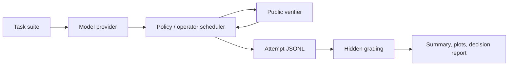

# TTC OperatorBench

[](https://github.com/nicholaszhao-19/ttc-operatorbench/actions/workflows/checks.yml)

TTC OperatorBench is a research harness for cost-aware test-time compute in
verifier-guided code generation. It provides typed schemas, fixed and adaptive
search policies, public/hidden verifier accounting, immutable candidate and
trajectory records, a sandboxed EvalPlus path, paired analysis, and
hash-verified derived results.

The project is designed as a research-engineering scaffold for test-time compute
experiments. It emphasizes reproducibility and auditability over headline
claims.

## Public Positioning

This repository is best read as a research-engineering artifact:

> A reproducible harness for evaluating budget-aware verifier-guided
> code-generation policies.

It is not presented as a state-of-the-art scheduler result. The strongest
current evidence is a real-model stopping result plus a negative repair
confirmation; the adaptive policy also does not dominate the strongest fixed
baseline in the deterministic control.

Recent validity repairs make this positioning stricter: policies receive a task
view with hidden data removed, batch selectors are charged their terminal
decision cost, hidden metrics grade the selected answer, and a fixed-sample
baseline reports Pass@k separately from selection. See
[the validity note](docs/validity_fixes.md).



## Research Question

Given a code task, a model provider, a verifier, and a finite budget, can an
adaptive search policy allocate operators more effectively than fixed
verifier-guided baselines?

The repository validates the harness and reports locked HumanEval+ and frozen
MBPP+ studies. It does not establish that adaptive operator allocation beats
strong real-model baselines.

## Motivation

Reasoning and coding systems often spend extra compute at inference time:
sampling candidates, running tests, repairing failures, revising outputs, or
switching prompting strategies. A credible evaluation needs to track both
success and the budget spent to reach success.

TTC OperatorBench makes those tradeoffs explicit through:

- attempt-level logs;
- public and hidden verifier outcomes;
- selected-answer hidden metrics plus oracle hidden diagnostics;
- token, attempt, verifier-call, and time budgets;
- baseline and adaptive search policies;
- success curves and aggregate metrics;
- decision reports that treat ties, losses, and inconclusive outcomes as
  first-class results.

## Implementation

- Typed schemas for tasks, generations, verifier results, attempts, budgets, and
  search results.
- Toy and curated local code tasks with public and hidden tests.
- Deterministic dummy providers for local structural controls.
- An opt-in Hugging Face provider for real-model smoke and curated runs.
- Baseline policies: greedy, verifier-guided best-of-N with early stopping,
  repair-only, plan-then-code, and local revision.
- Fixed-sample `monkey_sample_N` policies that draw all N candidates and report
  hidden-test Pass@k coverage without treating oracle coverage as selection.
- Differential-selection policy: `diffcodegen_select`, a lightweight
  DiffCodeGen-style baseline that clusters candidate behavior traces and selects
  the consensus-cluster medoid.
- Adaptive policies: `operator_bandit`, `bottleneck_controller`, and ablation
  variants.
- Configurable bandit state scope: `per_task` for structural controls and
  `per_run` for adaptive real-model protocols.
- Python unit-test verification for generated code.
- Config-driven experiment protocols under `configs/experiments/`.
- JSONL logging, JSON/CSV summaries, success-curve plots, and Markdown reports.

## Snapshot Result

The committed deterministic toy report is intentionally modest:

- verdict: `needs_analysis`;
- decision scope: hidden-test success;
- strongest baseline at two-call and four-call budgets: `best_of_n_2`;
- adaptive `operator_bandit`: solves the same tasks at those budgets but uses
  more tokens in the deterministic control.

See [the static demo result](docs/results/demo_report.md) and
[the research memo](docs/research_memo.md) for the public interpretation.

## Real-Model Width-Depth Result

The frozen 100-task MBPP+ confirmation did not replicate the preliminary
HumanEval+ repair gain. With the same Qwen2.5-Coder-1.5B revision and a maximum
16 calls per task, stop-only `16x1` sampling reached 73.0% selected hidden
accuracy, while `8x2` sampling-plus-repair reached 70.0%. The paired difference
was -3.0 points with a 95% bootstrap interval of [-8.0, +1.0]. `8x2` used 13
fewer calls but 8,637 more generation tokens because repair prompts were longer.

This is a negative confirmation result: `8x2` is not promoted, `16x1` remains
the fixed baseline to beat, and the controller gate is not met. See
[the full confirmation report](docs/results/stop_then_escalate_confirmation.md).

## Quickstart

These commands give the shortest local path through setup, checks, and the
smallest reproducible experiment.

```bash
uv sync --frozen --group dev
uv run ttc-operatorbench doctor
make check
uv run ttc-operatorbench run
uv run ttc-operatorbench verify-results
```

`make check` is the fastest no-model verification path. It uses repo-local
caches and avoids real-model downloads.

The default experiment is deterministic and local. It uses the dummy provider,
does not download model weights, and writes artifacts to:

```text
outputs/runs/toy_protocol/
reports/runs/toy_protocol/
```

Expected terminal output includes:

```text
wrote attempts to outputs/runs/toy_protocol/attempts.jsonl
wrote search results to outputs/runs/toy_protocol/search_results.jsonl
wrote summary to outputs/runs/toy_protocol/summary.json
wrote decision to outputs/runs/toy_protocol/decision.json
wrote report to reports/runs/toy_protocol/report.md
```

## Requirements

- Python 3.11 or 3.12
- `uv`

The supported local setup route is `uv sync --frozen --group dev`. Add the
optional Hugging Face group with `uv sync --frozen --group dev --group hf`
only for local-model runs. The repo uses `pyproject.toml` and `uv.lock`; it does not use
`requirements.txt` or `environment.yml`.

## Repository Structure

```text
.
|-- AGENTS.md
|-- Makefile
|-- README.md
|-- artifacts/results/     # Compact, hash-verified derived evidence.
|-- configs/
|   |-- experiments/        # Protocol configs for local and gated HF runs.
|   `-- models/             # Model roster and small model config notes.
|-- docs/                   # Overview, reproducibility, design, and results docs.
|-- outputs/                # Generated run outputs, ignored except .gitkeep.
|-- reports/                # Generated reports and plots, ignored except .gitkeep.
|-- scripts/                # Run, plotting, and portfolio-report entry points.
|-- src/ttc_operatorbench/  # Package source.
|-- tests/                  # Unit and integration tests.
|-- pyproject.toml
`-- uv.lock
```

Key source areas:

- `core/`: shared schemas and contracts.
- `tasks/`: toy and curated task definitions.
- `models/`: dummy and Hugging Face model providers.
- `verifiers/`: Python unit-test verifier.
- `search/`: baseline and adaptive search policies.
- `evals/`: experiment runner, metrics, plots, and portfolio reports.
- `logging/`: JSONL read/write helpers.

## Checks

Run all default checks:

```bash
make check
```

The target runs Ruff, mypy, pytest, and committed-result integrity verification.
Default checks are intended to be fast, deterministic, local, and free of real
model inference.

## Run Experiments

### Default Local Protocol

```bash
uv run --python 3.12 python scripts/run_experiment.py
```

Default config:

```text
configs/experiments/toy_protocol.yaml
```

The default protocol runs the toy task suite across baseline policies and
`operator_bandit` under a small budget sweep. It uses seed `0`.

### Curated Local Suite

Run the 50-task deterministic curated-code protocol:

```bash
uv run --python 3.12 python scripts/run_experiment.py \
  --config configs/experiments/curated_protocol.yaml
```

Run scheduler ablations on the same curated suite:

```bash
uv run --python 3.12 python scripts/run_experiment.py \
  --config configs/experiments/curated_ablation_protocol.yaml
```

Run a deterministic curated sweep with stronger best-of-N baselines:

```bash
uv run --python 3.12 python scripts/run_experiment.py \
  --config configs/experiments/curated_strong_baselines_protocol.yaml
```

### Foundational Fixed-Sample Baseline

Run the local repeated-sampling control:

```bash
uv run --python 3.12 python scripts/run_experiment.py \
  --config configs/experiments/monkey_toy_protocol.yaml
```

`monkey_sample_8` always draws all eight candidates, then reports Pass@1,
Pass@2, Pass@4, and Pass@8 from that one hidden-graded pool using the standard
unbiased estimator. Greedy and `best_of_n_4` receive the same deterministic
candidate stream. This validates sampling, logging, and metric arithmetic; it
is not a real-model performance result or a candidate-selection claim.

Run the first differential-selection milestone protocol:

```bash
uv run --python 3.12 python scripts/run_experiment.py \
  --config configs/experiments/differential_toy_protocol.yaml
```

This compares fixed baselines, `diffcodegen_select`, `operator_bandit`, and
`bottleneck_controller` on the toy suite. It is a local structural milestone,
not a LiveCodeBench or full DiffCodeGen reproduction.

### Portfolio Report

Aggregate completed config-driven runs:

```bash
uv run --python 3.12 python scripts/make_portfolio_report.py \
  --runs toy_protocol curated_protocol
```

Default output:

```text
reports/portfolio_report.md
```

Only include run IDs that already exist under `outputs/runs/` and
`reports/runs/`.

## Real-Model Smokes

Install the optional `hf` dependency group first. Real-model runs are opt-in so
default tests never download models. These legacy config-driven protocols use
the host-subprocess verifier, which is not a security sandbox. Prefer the
containerized EvalPlus runbook for untrusted model output. Running one requires
both the model gate and an explicit acknowledgement:

```bash
RUN_REAL_MODEL_TESTS=1 TTC_ALLOW_UNSANDBOXED_CODE=1 UV_CACHE_DIR=.uv-cache \
  uv run --python 3.12 python scripts/run_experiment.py \
  --config configs/experiments/hf_smoke_protocol.yaml
```

These commands may download model weights and can require substantial local
resources. They are not part of the default verification path.

## Local-Modest Real-Model Ladder

These older local-modest configs remain available for trusted engineering
probes. They are not the supported path for benchmark claims:

```bash
RUN_REAL_MODEL_TESTS=1 TTC_ALLOW_UNSANDBOXED_CODE=1 UV_CACHE_DIR=.uv-cache \
  uv run --python 3.12 python scripts/run_experiment.py \
  --config configs/experiments/hf_curated_qwen25_coder_05b_protocol.yaml \
  --run-id hf_qwen25_coder_05b_curated
```

```bash
RUN_REAL_MODEL_TESTS=1 TTC_ALLOW_UNSANDBOXED_CODE=1 UV_CACHE_DIR=.uv-cache \
  uv run --python 3.12 python scripts/run_experiment.py \
  --config configs/experiments/hf_curated_qwen25_coder_15b_probe_protocol.yaml \
  --run-id hf_qwen25_coder_15b_probe
```

```bash
RUN_REAL_MODEL_TESTS=1 TTC_ALLOW_UNSANDBOXED_CODE=1 UV_CACHE_DIR=.uv-cache \
  uv run --python 3.12 python scripts/run_experiment.py \
  --config configs/experiments/hf_curated_qwen25_coder_15b_protocol.yaml \
  --run-id hf_qwen25_coder_15b_curated
```

Run the one-task 7B probe before attempting the larger 7B protocol:

```bash
RUN_REAL_MODEL_TESTS=1 TTC_ALLOW_UNSANDBOXED_CODE=1 UV_CACHE_DIR=.uv-cache \
  uv run --python 3.12 python scripts/run_experiment.py \
  --config configs/experiments/hf_curated_qwen25_coder_7b_probe_protocol.yaml \
  --run-id hf_qwen25_coder_7b_probe
```

Then run the larger 7B protocol only if the probe completes:

```bash
RUN_REAL_MODEL_TESTS=1 TTC_ALLOW_UNSANDBOXED_CODE=1 UV_CACHE_DIR=.uv-cache \
  uv run --python 3.12 python scripts/run_experiment.py \
  --config configs/experiments/hf_curated_qwen25_coder_7b_protocol.yaml \
  --run-id hf_qwen25_coder_7b_curated
```

`Qwen/Qwen2.5-Coder-1.5B-Instruct` is the main local-modest model for this
stage. `Qwen/Qwen2.5-Coder-7B-Instruct` is a stronger local candidate only if
the machine can complete a first task without memory or time limits.

## Outputs And Reproducibility

Config-driven runs write:

- `attempts.jsonl`
- `search_results.jsonl`
- `summary.json`
- `summary.csv`
- `config_snapshot.yaml`
- `decision.json`
- `report.md`
- `success_vs_tokens.png`
- `success_vs_verifier_calls.png`

See:

- [Reproducibility guide](docs/reproducibility.md)
- [Experiment design](docs/experiment_design.md)
- [EvalPlus selection-regret preregistration](docs/experiments/evalplus_selection_regret.md)
- [EvalPlus selection-regret runbook](docs/experiments/evalplus_selection_runbook.md)
- [Stop-then-escalate preregistration](docs/experiments/stop_then_escalate.md)
- [Stop-then-escalate reproduction runbook](docs/experiments/stop_then_escalate_runbook.md)
- [Stop-then-escalate engineering pilot](docs/results/stop_then_escalate_pilot.md)
- [Stop-then-escalate development comparison](docs/results/stop_then_escalate_development.md)
- [Locked EvalPlus coverage/selection result](docs/results/evalplus_selection_regret_locked.md)
- [Results guide](docs/results_guide.md)
- [Research memo](docs/research_memo.md)
- [Demo result](docs/results/demo_report.md)
- [Hash-verified result bundle](artifacts/results/stop_then_escalate_v1/README.md)

If Matplotlib cannot write to its default cache directory, use a repo-local
cache:

```bash
MPLCONFIGDIR=.uv-cache/matplotlib uv run --python 3.12 python scripts/run_experiment.py
```

## Capabilities

- Test-time compute accounting for code reasoning tasks.
- Verifier-guided candidate selection with public and hidden test separation.
- Fixed-sample coverage scaling with Pass@k estimates.
- Baseline policy comparisons under fixed budgets.
- Adaptive operator selection through `operator_bandit`.
- Lightweight behavior-clustering selection through `diffcodegen_select`.
- Rule-based coverage/selection/stopping routing through `bottleneck_controller`.
- Budgeted evaluation over tokens, attempts, verifier calls, and time.
- Reproducible logs and reports for follow-up analysis.

## Current Empirical Status

`v0.1-ttc-harness` freezes the stable pre-hidden-tests harness. Work after that
tag adds the containerized EvalPlus pipeline and two real-model studies. The
current honest empirical status is:

- Local toy and curated deterministic protocols validate the pipeline, hidden
  grading, budget accounting, and conservative decision logic.
- The fixed-sample toy protocol validates Pass@k computation over a fully
  logged candidate pool; it does not provide model evidence.
- The locked 133-task HumanEval+ study finds Pass@k scaling from 47.6% to
  82.7%. First-public-pass selection reaches 80.5% and the equivalent stopping
  replay saves 72.5% of candidate calls.
- The frozen 100-task MBPP+ confirmation finds 73.0% hidden accuracy for
  `16x1` stop-only sampling and 70.0% for `8x2` sampling-plus-repair. The
  preliminary repair gain did not replicate.
- No real-model adaptive scheduler win is established. `16x1` stopping remains
  the empirical baseline to beat.
- The differential-selection path is currently deterministic and probe-based; it
  does not yet include coverage-guided fuzzing, LiveCodeBench, S*, or a full
  DiffCodeGen reproduction.

The negative confirmation is decision-relevant evidence: the current repair
operator introduces enough false acceptance and prompt-token cost that it
should not be promoted into a controller.

## Limitations

- Default runs use toy or deterministic local tasks and dummy providers.
- Real-model evidence covers one model revision and one generation seed.
- HumanEval+ and MBPP+ are function-level and are not time-filtered.
- The full S*, DiffCodeGen, learned-verifier, and agentic-verifier systems have
  not been reproduced under matched budgets.
- Differential selection currently uses task-visible call shapes and simple
  mutations as a fuzzing surrogate.
- Generic Hugging Face protocols use a host subprocess and require an explicit
  unsafe-code acknowledgement; benchmark work should use the EvalPlus container.

## Roadmap

- Replicate the stopping baseline across multiple seeds or a second model size.
- Add an untouched, time-filtered benchmark slice before another confirmatory claim.
- Test one fixed plan-before-regenerate escalation against `16x1`.
- Implement adaptive routing only after a fixed escalation demonstrates signal.

## Citation And Contact

No formal citation is included yet. If this project becomes associated with a
paper, preprint, or archived release, add a citation here.

For now, use the GitHub repository owner or issues for contact.
